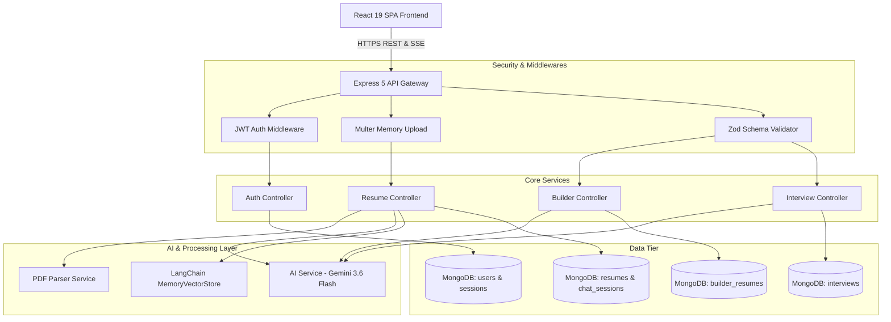
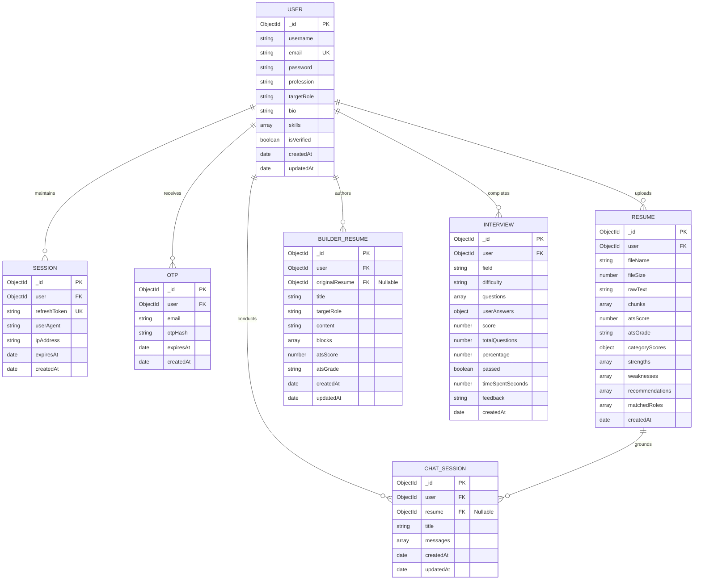

# AspireAI: Next-Generation AI-Powered Career Platform, ATS Intelligence & Technical Interview Ecosystem

---

## Executive Overview

**AspireAI** is an end-to-end, full-stack career acceleration and talent intelligence platform. It bridges the critical divide between modern hiring requirements and candidate readiness. By combining **Retrieval-Augmented Generation (RAG)**, **Google Gemini 3.6 Flash**, **LangChain**, and an **interactive BlockNote WYSIWYG editor**, AspireAI transforms raw career histories into ATS-optimized resumes and provides personalized technical interview simulations.

---

## Project Folder Structure

The repository is structured as a decoupled monorepo separating the Express 5 + TypeScript backend API from the React 19 + Vite + Tailwind CSS frontend application.

```
AspireAIR/
├── backend/                                   # Express 5 + TypeScript REST & Streaming API
│   ├── .env                                   # Server environment variables & API keys
│   ├── package.json                           # Dependencies & lifecycle scripts
│   ├── tsconfig.json                          # TypeScript compiler options (ES2022, NodeNext)
│   ├── test-e2e.js                            # 15-step Automated End-to-End Test Suite
│   ├── dist/                                  # Compiled production JavaScript bundle
│   └── src/
│       ├── index.ts                           # Server bootstrapper, CORS, routing & middlewares
│       ├── config/
│       │   ├── config.ts                      # Centralized validated environment config
│       │   └── mongodb_connect.ts             # Mongoose connection with reconnection lifecycle
│       ├── controllers/
│       │   ├── auth.controllers.ts            # Registration, OTP validation, login, refresh, logout
│       │   ├── builder.controllers.ts         # AI resume creation, updating, and token streaming
│       │   ├── interview.controllers.ts       # 10-round MCQ generation, scoring, and solutions
│       │   ├── resume.controllers.ts          # PDF upload, ATS analytics, Vector RAG chat & stream
│       │   └── users.controllers.ts           # Profile read/update and account management
│       ├── middlewares/
│       │   ├── auth.middleware.ts             # JWT Bearer token authentication & user attachment
│       │   ├── upload.middleware.ts           # Multer memory storage PDF validation (5MB max)
│       │   └── validate.middleware.ts         # Zod schema validation middleware
│       ├── models/
│       │   ├── Otp.model.ts                   # 6-digit cryptographic OTP schema (5-min TTL index)
│       │   ├── builderResume.models.ts        # Dynamic document schema for WYSIWYG resumes
│       │   ├── chat.models.ts                 # Chat session schema with optional resume reference
│       │   ├── interview.models.ts            # Mock interview schema with MCQs, scoring & timer
│       │   ├── resume.models.ts               # Parsed text, vector chunks & ATS breakdown
│       │   ├── session.models.ts              # Refresh token sessions with device telemetry
│       │   └── users.models.ts                # Candidate user profile schema with bcrypt hashing
│       ├── routes/
│       │   ├── auth.routes.ts                 # /api/auth endpoints
│       │   ├── builder.routes.ts              # /api/builder endpoints (REST & SSE)
│       │   ├── interview.routes.ts            # /api/interview endpoints
│       │   ├── resume.routes.ts               # /api/resume endpoints (REST & SSE)
│       │   └── users.routes.ts                # /api/users endpoints
│       ├── schemas/
│       │   └── user.schemas.ts                # Zod request validation schemas
│       ├── services/
│       │   ├── ai.service.ts                  # Gemini 3.6 Flash, LangChain RAG & single-pass jsonrepair
│       │   ├── email.service.ts               # Nodemailer SMTP email service with fallback
│       │   └── resumeParser.service.ts        # PDF binary parsing & recursive text chunking
│       ├── types/
│       │   └── express.d.ts                   # Express Request extension for authenticated user
│       └── utils/
│           ├── fetch-images.ts                # Zero-network SVG placeholder generators
│           └── generateOtp.ts                 # Cryptographically secure 6-digit OTP generator
│
└── frontend/                                  # React 19 + Vite 8 SPA Client
    ├── .env                                   # Client environment configuration
    ├── index.html                             # Single Page Application HTML5 entry point
    ├── package.json                           # Frontend dependencies & build scripts
    ├── vite.config.ts                         # Vite configuration with Tailwind CSS plugin
    └── src/
        ├── main.tsx                           # ReactDOM concurrent root initialisation
        ├── App.tsx                            # React Router v7 routes & global auth listener
        ├── index.css                          # Tailwind CSS v4 styling & dark theme variables
        ├── components/
        │   ├── AtsScoreCircle.tsx             # Animated SVG radial gauge for ATS score
        │   ├── CareerCoachChat.tsx            # RAG AI mentor chat with SSE streaming tokens
        │   ├── Navbar.tsx                     # Top navigation bar with user profile & status
        │   ├── ProtectedRoute.tsx             # Client-side route guard enforcing authentication
        │   ├── ResumeAnalyticsCard.tsx        # Multi-category ATS score breakdown & keyword gap
        │   ├── ResumeUploader.tsx             # Drag-and-drop PDF upload with canvas confetti
        │   └── RouteErrorBoundary.tsx         # Graceful error boundary for UI exceptions
        ├── pages/
        │   ├── DashboardPage.tsx              # Main candidate portal (Scanner, Coach, Vault)
        │   ├── ForgotPasswordPage.tsx         # Account recovery with OTP initiation
        │   ├── HomePage.tsx                   # Marketing landing page with feature cards
        │   ├── InterviewPage.tsx              # Interactive 10-round timed MCQ assessment
        │   ├── InterviewResultPage.tsx        # Scorecard, question breakdown & detailed solutions
        │   ├── LoginPage.tsx                  # Candidate login with JWT acquisition
        │   ├── ProfilePage.tsx                # Candidate profile, target role & skill editor
        │   ├── RegisterPage.tsx               # Candidate registration with email verification
        │   ├── ResetPasswordPage.tsx          # Password reset with OTP confirmation
        │   ├── ResumeBuilderPage.tsx          # BlockNote WYSIWYG editor with inline AI actions
        │   └── VerifyOtpPage.tsx              # 6-digit numeric OTP verification form
        ├── services/
        │   └── api.ts                         # Centralized fetch client with auto-refresh & SSE
        ├── store/
        │   └── useAppStore.ts                 # Zustand reactive state store
        ├── types/
        │   └── index.ts                       # Shared TypeScript interfaces & API contracts
        └── utils/
            ├── aiTransport.ts                 # BlockNote AI streaming transport adapter
            └── fetch-images.ts                # Local zero-latency SVG asset generation
```

---

## Tech Stack

| Domain | Technology | Purpose |
| :--- | :--- | :--- |
| **Backend Runtime** | **Node.js (v20+)** | Asynchronous, non-blocking event-driven runtime |
| **Backend Framework** | **Express 5.2** | High-throughput HTTP routing, middleware pipeline, SSE |
| **Language** | **TypeScript 5.8** | Strict compile-time type safety across both frontend and backend |
| **Primary Database** | **MongoDB 8+ / Atlas** | Document store with TTL indexes, arrays, and JSON documents |
| **ODM Layer** | **Mongoose 9.9** | Schema modeling, validations, timestamps, and queries |
| **Frontend Framework** | **React 19** | Concurrent rendering, declarative UI components, hooks |
| **Build Tool** | **Vite 8** | Lightning-fast HMR and optimized production bundling |
| **Styling** | **Tailwind CSS v4** | Utility-first, zero-runtime CSS with modern dark UI styling |
| **State Management** | **Zustand 5** | Lightweight reactive store with zero boilerplate |
| **Routing** | **React Router v7** | Client-side routing, protected routes, and error boundaries |
| **Rich Text Editor** | **BlockNote 0.46** | Notion-style block-based WYSIWYG editor for resume crafting |
| **AI LLM Engine** | **Google Gemini 3.6 Flash** | Ultra-low-latency generative inference for ATS & coaching |
| **LLM Orchestration** | **LangChain Core & Google GenAI**| Vector indexation, document retrieval, and prompt engineering |
| **Vector Store** | **MemoryVectorStore** | In-memory semantic similarity search with cosine distance |
| **PDF Extraction** | **pdf-parse-new** | Binary PDF stream parsing into clean UTF-8 text |
| **Text Chunking** | **RecursiveCharacterTextSplitter** | Semantic text splitting with chunk overlap for RAG |
| **Resilience & Parsing** | **jsonrepair** | Single-pass deterministic JSON recovery without 2nd-pass LLM review |
| **Authentication** | **JWT & bcrypt** | Access tokens (15m), refresh tokens (7d), and salted password hashing |
| **Validation** | **Zod 4** | Runtime schema validation for requests and user inputs |

---

## AI Features

### 1. Multi-Criteria ATS Scoring Engine (0–100)
* Automatically extracts and cleans raw text from binary PDF uploads using [`resumeParser.service.ts`](file:///C:/Users/N/Documents/projects/AspireAIR/backend/src/services/resumeParser.service.ts).
* Evaluates the resume against modern Applicant Tracking System standards across 5 core dimensions:
  1. **Formatting & Parseability (20%)**: Standard section headers, no complex nested tables or parsing blockers.
  2. **Keyword Optimization (25%)**: Relevance to modern engineering roles (e.g., TypeScript, React, Docker, CI/CD).
  3. **Quantifiable Impact (25%)**: Presence of metrics, KPIs, percentages, and business results.
  4. **Skills Relevance (15%)**: Alignment between hard technical skills and soft leadership competencies.
  5. **Structure & Readability (15%)**: Bullet point conciseness, action verb density, and STAR format adherence.
* Outputs concrete strengths, critical deficiencies, detected job roles, and a step-by-step improvement roadmap.

### 2. Retrieval-Augmented Generation (RAG) AI Career Coach
* Uses LangChain's [`RecursiveCharacterTextSplitter`](file:///C:/Users/N/Documents/projects/AspireAIR/backend/src/services/resumeParser.service.ts) to segment resumes into 600-character semantic chunks with 100-character overlap.
* Chunks are indexed in memory with vector embeddings. When a candidate submits a question, the retriever computes cosine similarities, injects the top-matching resume context, and grounds the AI response.
* **Dual-Mode Intelligence**:
  * **Vector RAG Active**: When a resume is selected, answers reference the candidate's exact projects, metrics, and background.
  * **General Mentor Mode**: When no resume is loaded, the coach functions as a senior engineering mentor answering interview, system design, and salary questions.

### 3. Real-Time Token Streaming (Server-Sent Events)
* Built on native HTTP chunked transfer (`text/event-stream`), enabling sub-50ms Time-To-First-Token (TTFT).
* Implemented across three dedicated endpoints:
  * `POST /api/resume/chat/stream`: Streams career coaching advice token-by-token.
  * `POST /api/builder/generate/stream`: Streams full ATS-compliant Markdown resumes.
  * `POST /api/builder/ai-write/stream`: Powers inline WYSIWYG BlockNote AI rewrites.

### 4. Interactive AI Resume Builder with BlockNote
* Notion-style block editor allowing users to drag, rearrange, and format resume blocks visually.
* Features inline AI transformation shortcuts:
  * **Improve**: Enhances tone, professional impact, and phrasing.
  * **XYZ Method**: Reformulates bullets into Google's *"Accomplished [X], as measured by [Y], by doing [Z]"* standard.
  * **Concise**: Eliminates fluff while retaining technical keywords.
  * **Role Align**: Adapts bullet points to target job specifications.
  * **Fix Grammar**: Eliminates passive voice and typographical mistakes.

### 5. Adaptive AI Technical Interviewer
* Generates 10 dynamic multiple-choice technical interview questions for any engineering field (Frontend, Backend, Full Stack, DevOps, AI/ML) and seniority level (Junior, Mid-Level, Senior).
* Includes a real-time countdown timer, auto-submit on timeout, immediate percentage scoring, and an interactive scorecard with detailed rationales for every option.

### 6. Ultra-Fast Latency Optimizations
* **Single-Pass Parsing with `jsonrepair`**: Bypasses secondary LLM review/auditor passes. JSON syntax errors or trailing commas are resolved locally in <1ms.
* **Zero-Network Image Generation**: Bypasses external image searches (Unsplash/Flickr). Avatars and icons are rendered as instant local SVG data URIs.
* **Token Budget Caps**: Capped generation tokens (2,000–3,000) and low temperature (0.2) to minimize inference latency and prevent token looping.

---

## 1. Introduction

In modern recruiting, more than **75% of resumes are filtered out by automated Applicant Tracking Systems (ATS)** before ever reaching a human hiring manager. Candidates frequently submit applications without understanding why their qualifications fail to pass algorithmic keyword matching or parsing filters.

Furthermore, job seekers face disjointed tooling: one site formats resumes, another performs superficial ATS scoring behind paywalls, a separate AI chat offers generic advice without context, and mock interview platforms are disconnected from the candidate's actual background.

**AspireAI** unifies the candidate journey into a single intelligent platform. It provides candidates with immediate, transparent ATS compatibility diagnostics, context-grounded conversational coaching, real-time AI resume rewriting, and adaptive technical interview preparation.

---

## 2. Limitations of Existing Systems

1. **Opaque, Keyword-Only ATS Checkers**:
   * Traditional resume scanners use naive regex keyword searching. They fail to understand semantic context, project complexity, or synonyms.
2. **Disconnected, Generic Generative AI**:
   * Standard chatbots (e.g., generic ChatGPT wrappers) lack direct retrieval grounding against the candidate's resume, resulting in superficial or hallucinated career advice.
3. **Rigid, Non-Editable Resume Generators**:
   * Most resume builders generate static PDFs. If an ATS error is detected, the candidate must re-edit an external document and re-upload from scratch.
4. **Static, Non-Adaptive Mock Interviews**:
   * Existing interview platforms rely on hardcoded question banks that become outdated quickly and do not adapt to the candidate's chosen domain or seniority.
5. **Slow Inference & Network Bottlenecks**:
   * Legacy tools suffer from multi-second generation latencies caused by secondary auditor passes, blocking external image fetches, and absence of token streaming.

---

## 3. Objectives

* **Democratize ATS Transparency**: Provide job seekers with instant, free, multi-category ATS diagnostics and actionable fix recommendations.
* **Contextual RAG Career Guidance**: Enable conversational career mentoring grounded in the candidate's actual project accomplishments using semantic vector search.
* **Sub-Second Streaming Performance**: Implement Server-Sent Events (SSE) streaming and ultra-fast model defaults (`gemini-3.6-flash`) for real-time responsiveness.
* **Integrated Interactive Authoring**: Allow users to generate, modify, and evaluate ATS-optimized resumes in an interactive WYSIWYG editor without leaving the application.
* **Comprehensive Technical Validation**: Provide timed, domain-specific mock interview simulations with automated scoring and educational answer breakdowns.
* **Enterprise-Grade Security**: Enforce cryptographic email OTP verification, salted password hashing, stateless JWT access tokens, and revocable refresh token sessions.

---

## 4. Scope

### 4.1 Functional Scope
* **User Authentication & Profiles**:
  * Email registration with cryptographically secure 6-digit OTP verification.
  * Login with automatic device/IP session tracking and refresh token rotation.
  * Password reset workflow with email verification.
  * Candidate profile management (profession, target role, technical skills).
* **Resume Parsing & ATS Diagnostics**:
  * Binary PDF ingestion, text normalization, and semantic chunking.
  * Multi-dimensional scoring (Overall 0–100, Formatting, Keywords, Impact, Skills, Readability).
  * Detection of matching job roles and bullet-by-bullet recommendations.
* **RAG AI Career Coach**:
  * Vector similarity search across uploaded resume chunks.
  * Token-by-token streaming chat responses via Server-Sent Events.
  * Context source disclosure showing exact resume chunks referenced.
  * Persistent chat history with one-click session clearing.
* **AI Resume Builder**:
  * One-click generation of ATS-optimized resumes from existing profile data.
  * Notion-style block editing (headings, bullet points, numbered lists, paragraphs).
  * Inline AI writing tools (Action-Impact XYZ, conciseness, role alignment).
  * Direct re-evaluation of builder resumes for ATS scoring.
* **AI Technical Interviewer**:
  * Dynamic generation of 10 field-specific multiple choice questions.
  * Configurable difficulty: Junior, Mid-Level, Senior.
  * Live countdown timer with automatic submission on expiry.
  * Comprehensive scorecard with percentage score, pass/fail status, and rationales.

### 4.2 Technical Scope
* **Client-Side Architecture**: React 19 Single Page Application bundled with Vite 8, utilizing Zustand for reactive global state management and Tailwind CSS v4 for responsive design.
* **Server-Side Architecture**: Express 5 on Node.js 20+ with ES Modules, structured following Controller-Service-Repository patterns with Zod schema validation.
* **Data Persistence**: MongoDB with Mongoose schemas, compound indexes for user-scoped queries, and TTL indexes for automated OTP document purging.
* **Streaming Protocol**: HTTP Server-Sent Events (`text/event-stream`) for streaming LLM tokens to the client with graceful fallback to standard JSON.

---

## 5. Technology Stack Detailed Analysis

### Backend Pipeline
* **Node.js & Express 5.2**:
  * Express 5 handles native Promise rejection without crashing, simplifying async controller workflows.
  * Modular routing organizes endpoints by business domain (`/api/auth`, `/api/resume`, `/api/builder`, `/api/interview`, `/api/users`).
* **MongoDB & Mongoose 9.9**:
  * Provides flexible document structures for storing variable resume data, vector chunks, and conversation histories.
  * Utilizes schema-level default values, timestamps, and indexes for optimized query performance.
* **LangChain & Google GenAI (`@langchain/google-genai`)**:
  * Implements `MemoryVectorStore` to create in-memory vector representations of resume text.
  * Leverages `gemini-3.6-flash` with deterministic temperature (`0.2`) for fast, structured JSON generation.
* **Resilience Layer (`jsonrepair`)**:
  * Automatically resolves common LLM JSON syntax defects (unquoted keys, missing brackets, trailing commas) locally in <1ms, avoiding expensive secondary LLM review passes.

### Frontend Pipeline
* **React 19 & Vite 8**:
  * Fast HMR and code-splitting produce an optimized production bundle.
* **Zustand 5**:
  * Centralizes global application state (`auth`, `resumes`, `activeResume`, `chatMessages`, `interviews`, `builderResumes`) with persistent browser token synchronization.
* **BlockNote (`@blocknote/react`)**:
  * Block-based rich text editor providing an intuitive, Notion-like user experience for resume editing.
* **Tailwind CSS v4**:
  * Employs modern CSS color variables and utility classes to achieve a polished, accessible dark-mode UI.

---

## 6. Advantages

1. **True RAG Accuracy**: Grounds every career coach response in the candidate's actual resume chunks, eliminating hallucinations.
2. **Sub-Second Streaming Feedback**: Server-Sent Events allow candidates to read AI responses immediately as tokens are generated.
3. **Integrated Workflow**: Eliminates tool-switching by combining ATS analysis, resume authoring, and interview preparation in a unified dashboard.
4. **Deterministic Single-Pass Speed**: Uses `jsonrepair` to achieve sub-second JSON parsing without secondary LLM correction calls.
5. **Zero-Network Image Latency**: Replaces external image API calls with local SVG data URIs, ensuring reliable, offline-capable asset delivery.
6. **Secure Session Management**: Employs short-lived JWT access tokens with rotating refresh tokens stored in HTTP-only cookies.

---

## 7. System Design

### 7.1 System Modules & Use Cases



### 7.2 Database Design

The database contains seven core collections:

1. **`users`**: Stores core user identity, credentials (bcrypt hashed), professional title, skills array, and verification status.
2. **`sessions`**: Tracks active refresh tokens, device user-agents, client IP addresses, and session expiration timestamps.
3. **`otps`**: Stores SHA-256 hashed 6-digit verification codes with a 5-minute MongoDB TTL index for automatic expiry.
4. **`resumes`**: Contains parsed resume text, raw metadata, extracted semantic chunks, overall ATS scores, category breakdowns, and recommendations.
5. **`chat_sessions`**: Maintains conversational threads between candidates and the AI coach, referencing the candidate and an optional resume ID.
6. **`builder_resumes`**: Stores dynamic resumes crafted in the BlockNote editor, including markdown content and ATS evaluation metrics.
7. **`interviews`**: Manages generated 10-round MCQ technical assessments, candidate answers, timers, and final scorecards.

---

## 8. ER-Diagram



---

## 9. Software Testing

The system includes an automated 15-step integration test suite ([`backend/test-e2e.js`](file:///C:/Users/N/Documents/projects/AspireAIR/backend/test-e2e.js)) covering the complete candidate lifecycle.

### 9.1 Detailed Test Cases

| Step | Test ID | Description | Input / Payload | Expected Output | Status |
| :--- | :--- | :--- | :--- | :--- | :--- |
| **1** | `TC-SYS-01` | System Health Check | `GET /api/health` | HTTP 200, `status: "healthy"` | **PASS** |
| **2** | `TC-AUTH-01`| Candidate Registration | User credentials + profession | HTTP 201, OTP created in DB | **PASS** |
| **3** | `TC-AUTH-02`| OTP Verification | 6-digit cryptographic OTP | HTTP 200, JWT Access Token | **PASS** |
| **4** | `TC-AUTH-03`| Candidate Login | Email + password credentials | HTTP 200, Session established | **PASS** |
| **5** | `TC-AUTH-04`| Profile Update | Target role + updated skills | HTTP 200, Persisted in MongoDB | **PASS** |
| **6** | `TC-RES-01` | PDF Ingestion & ATS Parsing | Binary PDF multipart upload | HTTP 201, ATS score calculated | **PASS** |
| **7** | `TC-RES-02` | Detailed ATS Report | `GET /api/resume/latest/analytics`| HTTP 200, 5 category scores | **PASS** |
| **8** | `TC-RES-03` | Re-Analyze Resume | `POST /api/resume/:id/analyze` | HTTP 200, Refreshed evaluation | **PASS** |
| **9** | `TC-CHAT-01`| Vector RAG AI Career Coach | Query grounded in resume | HTTP 200, Relevant chunks returned | **PASS** |
| **10**| `TC-CHAT-02`| AI Coach Follow-Up Query | Secondary strategic career query | HTTP 200, Conversational reply | **PASS** |
| **11**| `TC-CHAT-03`| Conversation History | `GET /api/resume/chat-history` | HTTP 200, Chronological message list | **PASS** |
| **12**| `TC-CHAT-04`| Clear Chat Session | `DELETE /api/resume/chat-history` | HTTP 200, Session purged | **PASS** |
| **13**| `TC-BLD-01` | AI Resume Builder Generation | Target role + instructions | HTTP 201, Markdown resume created | **PASS** |
| **14**| `TC-BLD-02` | Builder ATS Scoring | `POST /api/builder/:id/analyze` | HTTP 200, Score: 91/100 (Excellent) | **PASS** |
| **15**| `TC-INT-01` | Adaptive MCQ Interview | Field: "Full Stack Engineer" | HTTP 201, 10 dynamic MCQs | **PASS** |
| **16**| `TC-INT-02` | Interview Assessment Submit | 10 answers + time spent | HTTP 200, Scorecard (100% Pass) | **PASS** |
| **17**| `TC-STR-01` | SSE Token Stream Verification | `POST /api/resume/chat/stream` | HTTP 200, `text/event-stream` chunks | **PASS** |

---

## 10. Real-World Use Cases

### Use Case A: Recent College Graduate
* **Challenge**: The graduate has strong academic project experience but struggles with low ATS scores due to informal formatting and a lack of industry keywords.
* **AspireAI Solution**: The student uploads their resume, receives an immediate ATS score breakdown highlighting missing technical keywords, uses the **AI Resume Builder** to restructure projects into STAR format, and practices with the **AI Technical Interviewer** to prepare for entry-level engineering interviews.

### Use Case B: Senior Engineer Pivoting to AI/ML
* **Challenge**: An experienced Full-Stack Engineer wants to transition into AI Engineering but is unsure how to highlight transferable skills.
* **AspireAI Solution**: The candidate uploads their existing resume and consults the **AI Career Coach** in RAG mode. The coach identifies transferable backend and systems skills, suggests emphasizing LangChain and vector databases, and generates targeted resume bullet points using the **Action-Impact XYZ** feature.

### Use Case C: Career Accelerator / Bootcamp Program
* **Challenge**: Bootcamps need to prepare cohorts of graduates for competitive technical job applications simultaneously.
* **AspireAI Solution**: Students use the platform for automated resume screening and standardized 10-round technical assessments, allowing instructors to monitor progress and identify knowledge gaps across the cohort.

---

## 11. Deployment Guide (Vercel & Render)

### Architecture Overview
* **Frontend**: Deployed to **Vercel** (Global Edge CDN, automatic HTTPS, continuous deployment from Git).
* **Backend**: Deployed to **Render** as a Node.js Web Service with persistent environment variables.
* **Database**: Hosted on **MongoDB Atlas** with IP whitelisting.

---

### Step 1: Deploy Backend to Render

1. **Create Web Service**:
   * Navigate to [Render Dashboard](https://dashboard.render.com/) > **New** > **Web Service**.
   * Connect your GitHub repository: `https://github.com/AGuptaRoot/AspireAI.git`.
2. **Configure Service Settings**:
   * **Root Directory**: `backend`
   * **Runtime**: `Node`
   * **Build Command**: `npm install && npm run build`
   * **Start Command**: `node dist/index.js`
3. **Configure Environment Variables**:
   Add the following environment variables in the Render dashboard:
   ```ini
   NODE_ENV=production
   PORT=8000
   CLIENT_URL=https://your-aspireai-frontend.vercel.app
   MONGODB_URI=mongodb+srv://<username>:<password>@cluster0.mongodb.net/aspireai?retryWrites=true&w=majority
   JWT_SECRET=your_super_secret_jwt_key_at_least_32_characters
   JWT_EXPIRES_IN=15m
   REFRESH_TOKEN_SECRET=your_super_secret_refresh_key_32_chars
   REFRESH_TOKEN_EXPIRES_IN=7d
   GEMINI_API_KEY=AIzaSy...your_gemini_api_key
   GEMINI_MODEL=gemini-3.6-flash
   SMTP_HOST=smtp.gmail.com
   SMTP_PORT=587
   SMTP_USER=your_email@gmail.com
   SMTP_PASS=your_app_password
   EMAIL_FROM="AspireAI" <no-reply@aspireai.com>
   ```
4. **Deploy & Copy URL**:
   * Click **Create Web Service**.
   * Once deployed, note your service URL (e.g., `https://aspireai-backend.onrender.com`).

---

### Step 2: Deploy Frontend to Vercel

1. **Import Project into Vercel**:
   * Navigate to [Vercel Dashboard](https://vercel.com/dashboard) > **Add New** > **Project**.
   * Select your GitHub repository.
2. **Configure Build Settings**:
   * **Framework Preset**: `Vite`
   * **Root Directory**: `frontend`
   * **Build Command**: `npm run build`
   * **Output Directory**: `dist`
   * **Install Command**: `npm install`
3. **Configure Environment Variables**:
   Add the backend URL variable:
   ```ini
   VITE_BACKEND_URL=https://aspireai-backend.onrender.com
   ```
4. **Add SPA Routing Configuration**:
   Create a `vercel.json` file inside the `frontend/` directory to handle React Router client-side routing:
   ```json
   {
     "rewrites": [
       { "source": "/(.*)", "destination": "/index.html" }
     ]
   }
   ```
5. **Deploy**:
   * Click **Deploy**. Vercel will build and distribute your frontend globally across its Edge Network.

---

### Step 3: Final Verification
* Log in to the production Vercel URL.
* Complete registration with email OTP verification.
* Upload a sample PDF resume to verify ATS scoring, RAG coaching, and SSE streaming token delivery.

---

## 12. References

1. **Google Generative AI Documentation**:  
   *Gemini Models, Structured Outputs & Streaming APIs.* [https://ai.google.dev/docs](https://ai.google.dev/docs)
2. **LangChain Documentation**:  
   *Retrieval-Augmented Generation (RAG) Architecture & Vector Store Retrievers.* [https://js.langchain.com/](https://js.langchain.com/)
3. **Applicant Tracking System (ATS) Architecture Standards**:  
   *Resume Parsing Algorithms, Keyword Frequency Weighting, and Document Structure Guidelines.* National Association of Colleges and Employers (NACE).
4. **BlockNote Framework**:  
   *Notion-Style Block-Based WYSIWYG Editor for React Applications.* [https://www.blocknotejs.org/](https://www.blocknotejs.org/)
5. **Express.js v5 Release Notes**:  
   *Asynchronous Error Handling and Middleware Architecture.* [https://expressjs.com/](https://expressjs.com/)
6. **Tailwind CSS v4 Engine**:  
   *Modern CSS Engine and Zero-Configuration Build Optimization.* [https://tailwindcss.com/](https://tailwindcss.com/)

---

## 13. Bibliography

* Lewis, P., Perez, E., Piktus, A., Petroni, F., Karpukhin, V., Goyal, N., Küttler, H., Lewis, M., Yih, W., Rocktäschel, T., Riedel, S., & Kiela, D. (2020). *Retrieval-Augmented Generation for Knowledge-Intensive NLP Tasks*. Advances in Neural Information Processing Systems (NeurIPS 2020).
* Vaswani, A., Shazeer, N., Parmar, N., Uszkoreit, J., Jones, L., Gomez, A. N., Kaiser, Ł., & Polosukhin, I. (2017). *Attention Is All You Need*. 31st Conference on Neural Information Processing Systems (NIPS 2017).
* Fielding, R. T. (2000). *Architectural Styles and the Design of Network-based Software Architectures*. Doctoral dissertation, University of California, Irvine.
* Rescorla, E. (2018). *The Transport Layer Security (TLS) Protocol Version 1.3*. RFC 8446, Internet Engineering Task Force.
* Chodorow, K. (2013). *MongoDB: The Definitive Guide (2nd ed.)*. O'Reilly Media. ISBN: 978-1449344689.
